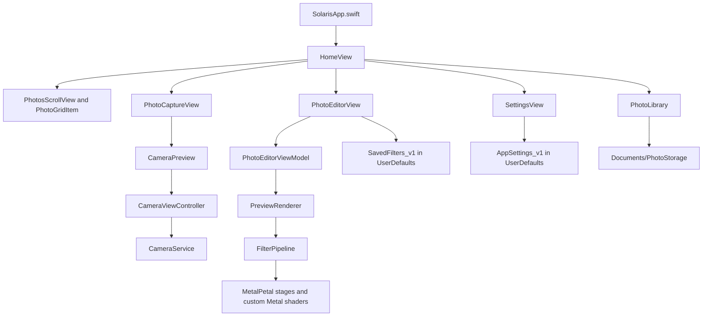

# Architecture

Solaris is a feature-organized native iOS app. SwiftUI owns the app shell and most screens, while UIKit is used where the project needs platform controllers such as AVFoundation camera preview and iOS share sheets.

## System Shape



## App Entry And Lifecycle

`solaris/SolarisApp.swift` is the `@main` entry point. It creates a `ColorSchemeManager`, injects it into the SwiftUI environment, and observes `scenePhase`.

When the app enters the background or becomes active, `SolarisApp` posts camera pause/resume notifications. `CameraViewController` listens to those notifications and delegates session control to `CameraService`.

## Feature Modules

### Home

`solaris/Features/Home/View/HomeView.swift` is the main user surface. It owns the in-memory list of `PhotoRecord` values and thumbnail `UIImage` values, then coordinates:

- Initial manifest loading through `PhotoLibrary.loadManifest()`.
- Photo import through `PhotosPickerItem`.
- Camera presentation through a `fullScreenCover`.
- Editor navigation through `navigationDestination`.
- Local delete, share, and thumbnail cache updates.
- Settings presentation through `SettingsView`.

`PhotosScrollView` renders the grid and selection actions. `PhotoGridItem` renders individual square thumbnails and handles tap/long-press selection behavior.

### Camera

The camera stack is split by framework responsibility:

- `PhotoCaptureView` is the SwiftUI camera screen and permission gate.
- `CameraPreview` is the `UIViewControllerRepresentable` bridge.
- `CameraViewController` owns UIKit gestures, preview-layer layout, focus indicators, flash overlay, and lifecycle cleanup.
- `CameraService` owns AVFoundation configuration, capture settings, session queue, zoom, focus, exposure, camera switching, and photo output callbacks.

`CameraCommands` is a small reference bridge that lets SwiftUI controls call actions on the UIKit controller without recreating the controller on every SwiftUI render.

### Photo Editor

`PhotoEditorView` composes the editing experience:

- Main image display through `PhotoEditorMainImage`.
- Filter browser through `PhotoEditorFilters`.
- Adjustment controls through `PhotoEditorAdjustments` and `MappedSlider`.
- Toolbar switching between filters, edit controls, and export.
- Save/discard overlay, undo/redo controls, saved-filter alert, and share export.

`PhotoEditorViewModel` owns edit state, base filter state, combined state, preview image generation, undo/redo history, interactive slider transactions, and final image generation.

The editor distinguishes two filter application modes:

- Tap applies a preset as `baseFilterState`, so sliders stay visually neutral while the filter remains part of rendering.
- Long press applies a preset directly to `editState`, so the slider values represent the preset.

`FilterStateManager` combines and compares base/edit state. This is the safest place to change filter-composition semantics because UI indicators, rendering state, and persistence rely on it.

### Settings

`solaris/Features/Settings/View/SettingsView.swift` edits `AppSettings.shared`, which is injected through the environment when the settings sheet opens.

Current settings include:

- Metadata preservation.
- Export color profile preference.
- Persisted undo history limit.
- Front camera mirroring.

## Rendering Pipeline

`PreviewRenderer` creates two preview bases from the source image:

- A higher-resolution base for normal preview and zoom.
- A lower-resolution base for responsive slider interaction.

During interaction, the renderer switches to the low-resolution base and cancels in-flight render tasks. When interaction ends, it switches back to the high-resolution base and regenerates the preview.

`FilterPipeline.standard(grainSeed:)` defines the standard rendering order:

1. Saturation
2. Vibrance
3. Exposure
4. Brightness
5. Contrast
6. Fade
7. Opacity
8. Pixelate
9. Clarity
10. Sharpen
11. Color tint or duotone
12. Skin tone
13. Color invert
14. Vignette
15. Grain

Most stages use MetalPetal built-in filters. `DuotoneFilter`, `SkinToneFilter`, `VignetteFilter`, and `LumaGrainFilter` use custom shader functions from `solaris/Features/PhotoEditor/Processing/Shaders/Effects.metal`.

`PreviewRenderer.generateFinalImage(...)` reloads the original image from file or data when available, applies orientation fixes, runs the same pipeline against the full-quality source, and returns the final `UIImage`.

## Persistence Model

Solaris does not use a database. Photos are stored under the app container:

```text
Documents/PhotoStorage/
├── originals/
├── thumbs/
├── edits/
├── manifest.json
└── manifest.json.bak
```

`PhotoRecord` stores:

- Stable photo id.
- Original file URL.
- Thumbnail file URL.
- Optional edited file URL.
- Optional `PhotoEditState`.
- Optional `baseFilterState`.
- Optional persisted edit history.
- Creation date.

`PhotoLibrary` is a singleton that:

- Creates the storage directories.
- Excludes the storage root from iCloud backup.
- Loads `manifest.json`, falling back to `manifest.json.bak`.
- Normalizes file URLs when the app container path changes.
- Drops manifest records whose original file no longer exists.
- Writes manifest data through a temporary file and replacement step.
- Deletes files for removed records.
- Cleans orphan files that are no longer referenced by the manifest.

`PhotoSaveService` is an actor with save helpers for captured and edited photos, but the current `HomeView` still contains direct save logic for capture and editor save flows. Treat this as an architectural transition point rather than a fully centralized save layer.

## UserDefaults State

`AppSettings` stores the encoded `AppSettings_v1` payload in UserDefaults. `SavedFiltersStore` stores an encoded `[SavedFilterRecord]` under `SavedFilters_v1`.

These stores are app-local and do not synchronize with a backend.

## Localization

`solaris/Localizable.xcstrings` declares English as the source language and includes Brazilian Portuguese translations. New visible app strings should be added through `String(localized:)` and kept in English as the source string.

## External Dependencies

The current Xcode project uses Swift Package Manager packages for:

- MetalPetal image processing.
- FluidGradient visual accents.
- Phosphor Swift icons.

No CocoaPods, Carthage, backend SDK, analytics SDK, authentication SDK, or cloud database SDK was found.

## Architectural Limitations

- Tests are currently template-level and do not protect the editor pipeline, persistence model, or camera flow.
- `HomeView` performs some file I/O and save orchestration directly, even though `PhotoSaveService` exists.
- `PhotoLibrary`, `AppSettings`, `SavedFiltersStore`, and `ImageCache` are singletons. There is no formal dependency-injection layer.
- There is no remote backup, sync, account model, or import/export catalog migration system.
